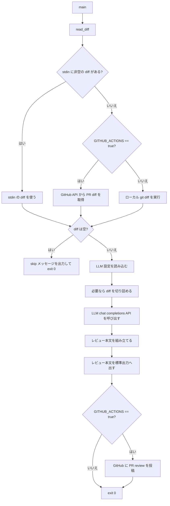
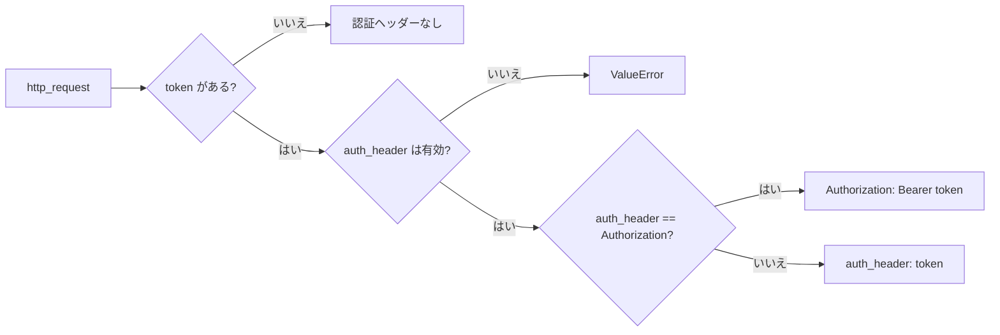
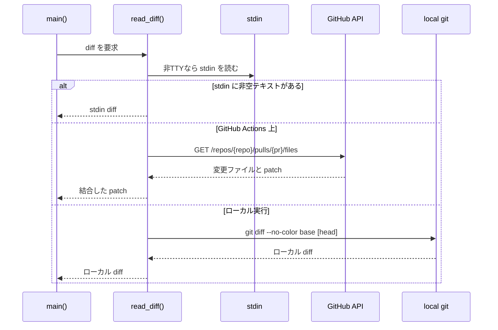
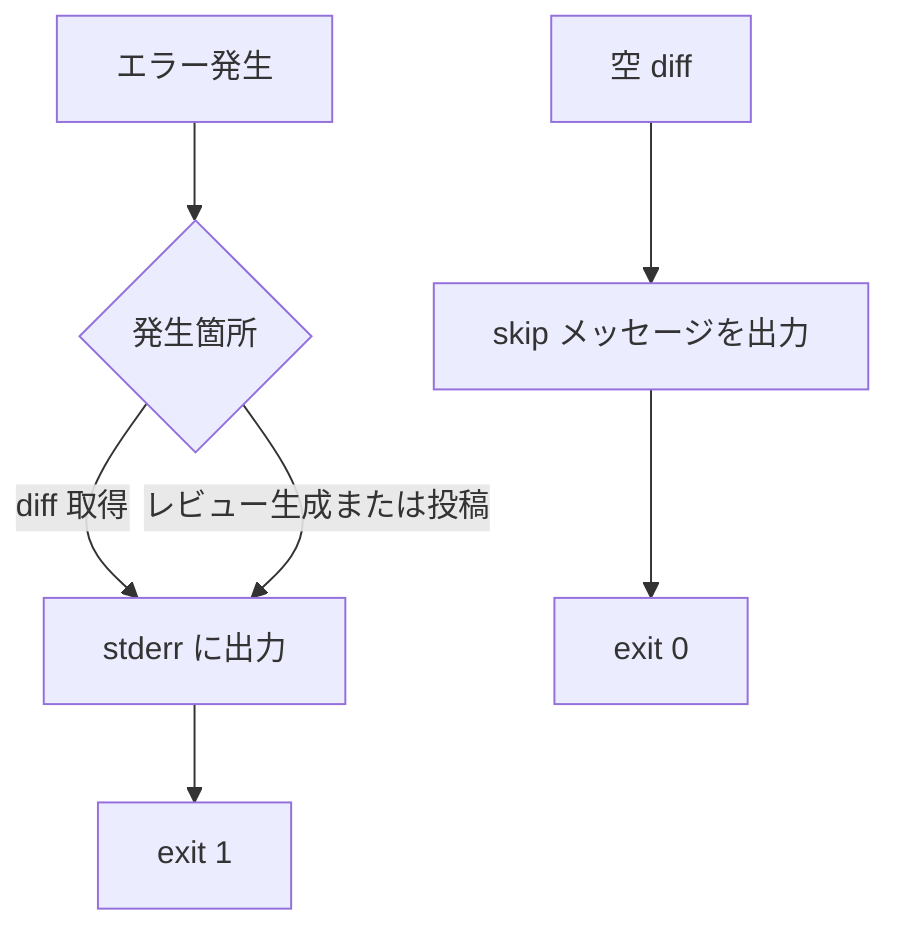

# src/main.py デザインドキュメント

## 目的

`src/main.py` は Git の差分を OpenAI 互換の LLM API にレビューさせ、Markdown 形式のレビュー本文を出力するスクリプトです。GitHub Actions 上で実行された場合は、生成したレビュー本文を pull request review comment として投稿します。

このスクリプトは、以下の3種類の差分取得方法に対応します。

- 標準入力から渡された非空の diff
- GitHub Actions 上での GitHub Pull Request Files API
- ローカル実行時の `git diff`

## 全体フロー



## 構成要素

### ファイル構成

`src/` 配下は責務ごとに分割しています。

- `src/main.py`: エントリポイント。全体の制御、終了コード、GitHub Actions 時の投稿制御
- `src/settings.py`: 環境変数と GitHub/LLM 設定の読み込み
- `src/http_client.py`: `requests` を使った HTTP リクエスト共通処理
- `src/github_client.py`: GitHub PR diff 取得と PR review 投稿
- `src/diff_reader.py`: stdin、GitHub Actions、ローカル git からの diff 取得
- `src/reviewer.py`: LLM へのレビュー依頼、レスポンス抽出、レビュー本文生成

### 設定

必須の LLM 用環境変数:

- `LLM_API_BASE_URL`: OpenAI 互換 API のベース URL
- `LLM_API_KEY`: LLM API に `apiKey` ヘッダーで送る API key

任意のレビュー用環境変数:

- `REVIEW_MODEL`: 使用するモデル名。未設定時は `preview/Kimi-K2.6`
- `MAX_DIFF_CHARS`: LLM に送る diff の最大文字数。未設定時は `12000`
- `REVIEW_DEBUG`: `1` の場合、リクエストとレスポンスのデバッグ情報を出力
- `REVIEW_BASE`: ローカル `git diff` の base。未設定時は `HEAD`
- `REVIEW_HEAD`: ローカル `git diff` の head。任意

GitHub Actions で必要な環境変数:

- `GITHUB_TOKEN`: GitHub API 呼び出しに使う token
- `GITHUB_REPOSITORY`: `owner/name` 形式のリポジトリ名
- `PR_NUMBER` または `GITHUB_EVENT_PATH`: pull request 番号の取得元
- `GITHUB_API_URL`: GitHub API のベース URL。未設定時は `https://api.github.com`

### HTTP クライアント

`http_request()` は GitHub API と LLM API の両方で使う共通 HTTP ヘルパーです。

認証ヘッダーの扱い:

- GitHub API はデフォルトの `Authorization: Bearer <token>` を使います。
- LLM API は `auth_header="apiKey"` を指定し、API key を `apiKey: <token>` として送ります。

`auth_header` は HTTP ヘッダー名として安全な token 形式だけを許可します。これにより、空白、制御文字、コロンなどの不正な文字を含むヘッダー名を拒否します。



### diff 取得

`read_diff()` は以下の優先順位で diff を選びます。

1. 標準入力に渡された非空の diff
2. GitHub Actions 上での GitHub Pull Request Files API
3. ローカルの `git diff`

空文字または空白のみの標準入力は無視します。これにより、誤って空のパイプ入力が渡された場合でも、GitHub API またはローカル diff へのフォールバックを妨げません。



### GitHub PR diff 取得

`fetch_pr_diff_files()` は Pull Request Files API をページングしながら呼び出します。

- `per_page=100`
- `page=1..n`

`patch` を持つ各 file item は、簡易的な unified diff 形式のブロックに変換します。

```diff
--- a/path
+++ b/path
@@ ...
```

追加ファイルと削除ファイルでは、該当する側に `/dev/null` を使います。`patch` がないファイルはスキップします。GitHub はバイナリファイルや非常に大きな差分で `patch` を省略することがあります。

### LLM レビュー

`review_diff()` は chat completions API に次のリクエストを送ります。

- `model`: `REVIEW_MODEL` または `DEFAULT_MODEL`
- `messages[0]`: 日本語レビュー用の固定 system prompt
- `messages[1]`: Markdown の `diff` コードブロックで囲んだ diff

レスポンス本文は、複数の形に対応して取り出します。

- `message.content` が文字列
- `message.content` が text/content part のリスト
- `message.content` が text/content を持つ dict
- fallback として `message.reasoning_content` または `message.reasoning`

LLM API が 2xx 以外を返した場合は `ValueError` を投げます。`choices`、`message`、assistant text が欠けている場合は `RuntimeError` を投げます。

### PR review 投稿

`GITHUB_ACTIONS=true` の場合、生成したレビュー本文を次の API に投稿します。

```text
POST /repos/{owner}/{repo}/pulls/{pull_number}/reviews
```

payload:

```json
{
  "body": "...",
  "event": "COMMENT"
}
```

本文は必ず `<!-- ai-review -->` から始まります。将来的に既存レビューの更新や削除を実装する場合、このマーカーで bot 生成レビューを識別できます。

## エラーハンドリング

`main()` には2つのエラー境界があります。

- diff 取得時のエラー
- LLM レビュー生成および GitHub 投稿時のエラー

捕捉した例外は stderr に出力し、終了コード `1` で終了します。空の diff は失敗扱いにせず、skip メッセージを出して終了コード `0` で終了します。



## セキュリティ考慮

- LLM API key は GitHub Actions secrets またはローカル `.env` から渡します。
- GitHub token は `Authorization: Bearer` で送ります。
- LLM token は対象 API の仕様に合わせて `apiKey` で送ります。
- カスタム認証ヘッダー名は厳格な token 正規表現で検証します。
- `REVIEW_DEBUG=1` は payload と response を出力するため、機密情報がログに残る環境では有効化しないでください。

## 既知の制限

- 大きな diff は token 数ではなく文字数で切り詰めます。
- GitHub file item に `patch` がない場合、そのファイルはレビュー対象から外れます。
- 実行ごとに新しい PR review comment を投稿します。既存の `<!-- ai-review -->` コメント更新は行いません。
- `http_request()` は Python 標準ライブラリのみを使っており、retry や rate limit backoff は実装していません。
- LLM レスポンス parser は chat-completions 形式を前提にしています。

## テスト範囲

`tests/test_main.py` では以下を検証しています。

- GitHub API 用 Bearer 認証ヘッダー
- LLM API 用 `apiKey` 認証ヘッダー
- 不正な認証ヘッダー名の拒否
- stdin、GitHub Actions、ローカル diff のフォールバック
- LLM API の 2xx 以外レスポンス処理

テスト実行:

```bash
uv run pytest -q
```
