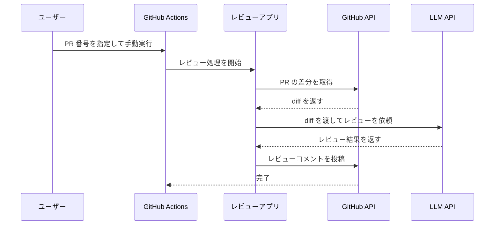

# 処理概要

GitHub Actions で手動実行し、PR の差分を LLM にレビューさせて、結果を PR に投稿する流れです。

```mermaid
sequenceDiagram
    participant User as ユーザー
    participant Actions as GitHub Actions
    participant App as レビューアプリ
    participant GitHub as GitHub API
    participant LLM as LLM API

    User->>Actions: PR 番号を指定して手動実行
    Actions->>App: レビュー処理を開始
    App->>GitHub: PR の差分を取得
    GitHub-->>App: diff を返す
    App->>LLM: diff を渡してレビューを依頼
    LLM-->>App: レビュー結果を返す
    App->>GitHub: レビューコメントを投稿
    GitHub-->>Actions: 完了
```
